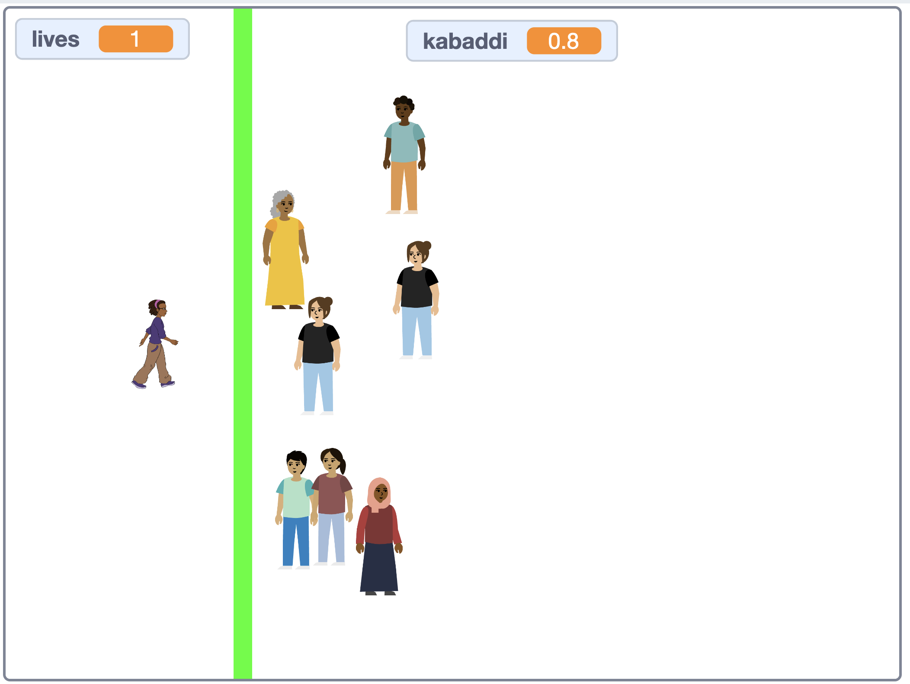

## What you will make

Make a tag-style game inspired by [kabaddi](https://en.wikipedia.org/wiki/Kabaddi), where the player must cross a line, tag opponents, and return safely while managing a countdown timer by pressing the spacebar! 

### Rules:
- Use the arrow keys to tag opponents
- You can only touch one opponent at a time, or you will lose a life
- Opponents will chase you, but cannot cross the green line
- You must press the space bar **at least once every second**, or you will lose a life

--- print-only ---

--- /print-only ---

--- no-print ---

 <iframe allowtransparency="true" width="485" height="402" src="https://scratch.mit.edu/projects/embed/1175744884/?autostart=false" frameborder="0"></iframe>

--- /no-print ---
