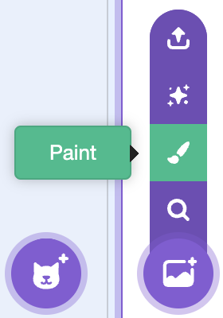
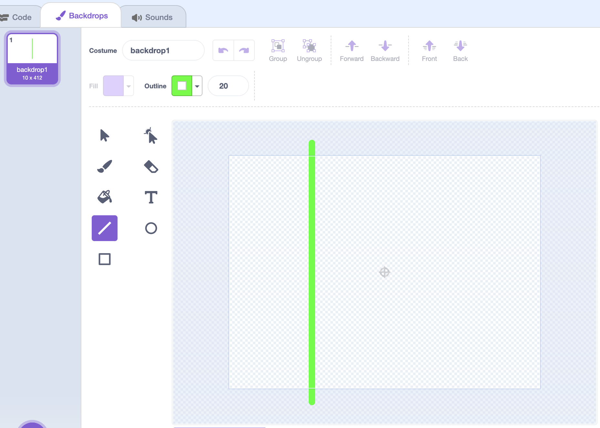
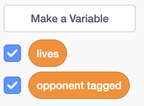

## Stage Setup

Set up the game by drawing the green line and making all the variables you will need.

--- task ---

Paint the “green line”. This sets a safe zone for the player.



In the **Backdrops** editor, draw a vertical green line at x = –100. It should be 20 pixels thick.



--- /task ---

--- task ---

Create five variables: `lives`{:class='block3variables'} , `opponent tagged`{:class='block3variables'}, `player tagged`{:class='block3variables'}, `touching`{:class='block3variables'}, and `kabaddi`{:class='block3variables'}. 



These variables will control game state, collisions, and scoring.

--- /task ---

--- task ---

Write the game “Start” script:


```blocks3
when green flag clicked
set [lives v] to (5)
set [opponent tagged v] to (0)
set [player tagged v] to (0)
set [touching v] to (0)
broadcast [start v]
broadcast [kabaddi v]
```

This prepares the game state and triggers the start and countdown broadcasts. 

First, it gives the player 5 lives and resets all the variables to 0. Then, it sends two broadcasts out - one which starts all the other sprites, and one which will eventually start a timer to make sure the player is 'saying kabaddi' while playing.

--- /task ---

Add the counters for both `lives`{:class='block3variables'} and `opponent tagged`{:class='block3variables'}, as these are the two variables that control winning and losing the game.

--- task ---

Tagging 7 opponents means you win. Add this code to the bottom of your script:


```blocks3
when green flag clicked
set [lives v] to (5)
set [opponent tagged v] to (0)
set [player tagged v] to (0)
set [touching v] to (0)
broadcast [start v]
broadcast [kabaddi v]
+forever
+if <(opponent tagged) = (7)> then
    broadcast [win v]
    wait (3) seconds
+end
+end
```

--- /task ---

--- task ---

Add the code for running out of lives:

```blocks3
when green flag clicked
set [lives v] to (5)
set [opponent tagged v] to (0)
set [player tagged v] to (0)
set [touching v] to (0)
broadcast [start v]
broadcast [kabaddi v]
forever
if <(opponent tagged) = (7)> then
    broadcast [win v]
    wait (3) seconds
end
+if <(lives) = (0)> then
    broadcast [lose v]
    wait (3) seconds
+end
end
```

--- /task ---

--- task ---

**Test your code.** Click the 

--- /task ---

In the next step, make the controls for your player!

--- save ---