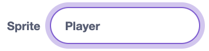

## Player Setup and Controls

Add the player sprite and make it move around.

--- task ---

Delete `Sprite1` by clicking on the bin icon on the thumbnail:

[Scratch cat sprite thumbnail labelled “Sprite1” with a delete icon.](images/scratch-thumbnail.png)

--- /task ---

--- task ---

Import the Player sprite from the sprite menu. Choose anything you like — in this example we will use the `Avery walking` sprite:


Rename this sprite `Player`.



--- /task ---

--- task ---

Create the “start” script for the player:


```blocks3
when I receive [start v]
set size to (25)%
go to x:(-160) y:(0)
wait (1) seconds
```

This ensures the player begins in the correct position and scale.

--- /task ---

--- task ---

Add arrow-key movement:


```blocks3
when I receive [start v]
set size to (25)%
go to x:(-160) y:(0)
wait (1) seconds
+repeat until <(lives) = (0)>
    if <key (up arrow v) pressed?> then // allows player to move up
        change y by (10)
    end
    if <key (down arrow v) pressed?> then // allows player to move down
        change y by (-10)
    end
    if <key (right arrow v) pressed?> then // allows player to move right
        change x by (10)
    end
    if <key (left arrow v) pressed?> then // allows player to move left
        change x by (-10)
    end
+end
```


--- /task ---

--- task ---

Add the code now that will stop the game if the player wins or loses:


```blocks3
when I receive (lose v)
say [TRY AGAIN!] for (2) seconds
stop [all v]

when I receive (win v)
say [YOU WIN!] for (2) seconds
stop [all v]
```

--- /task ---

--- task ---

**Test your code.** Click the green flag and make sure you can control the player sprite.

--- /task ---

In the next step, make opponents who will chase the player!

--- save ---