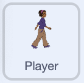
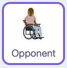
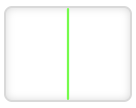

## Interactions & Game Logic
Add the rules for tagging, counting points, losing lives, and running the kabaddi timer.

--- task ---

In the Player sprite, detect when the player tags an opponent clone:




```blocks3
when I receive [start v]
set size to (25)%
go to x:(-160) y:(0)
wait (1) seconds
repeat until <(lives) = (0)>
    if <key [up arrow] pressed?> then
        change y by (10)
    end
    if <key [down arrow] pressed?> then
        change y by (-10)
    end
    if <key [right arrow] pressed?> then
        change x by (10)
    end
    if <key [left arrow] pressed?> then
        change x by (-10)
    end
    if <key [space v] pressed?> then
        set [kabaddi v] to (1)
    end
+   if <touching [Opponent v]?> then
+        broadcast [tag opponent v]
+    end
end
````

This tells the game when a tag occurs.

--- /task ---

--- task ---

Click the green flag. Touch a clone with the player to check the broadcast fires correctly.

--- /task ---


--- task ---

In the Opponent sprite (for each clone), detect when it touches the player:



```blocks3
when I start as a clone
switch costume to (pick random (1) to (13))
go to x:(pick random (-100) to (240)) y:(pick random (-180) to (180))
show
repeat until <(lives) = (0)> // until the player runs out of lives
    point towards [Player v]
    turn right (pick random (-70) to (70)) degrees //turn slightly away from player to make movement more random
    move (2) steps // bigger number  = harder game
    if on edge, bounce
+    if <touching [Player v]?> then // Add 1 to 'touching' variable if touching player
+        change [touching v] by (1)
+        wait until <not <touching [Player v]?>> // Remove 1 from 'touching' variable if not touching player
+        change [touching v] by (-1)
+    end
```

This increases the `touching` count when a clone touches the player and resets when it stops.

--- /task ---

--- task ---

Move into a clone — the `touching` variable should increase while touching, then return to 0.

--- /task ---

--- task ---
In the `opponent` sprite detect if it touches the green safe line:


when I start as a clone
switch costume to (pick random (1) to (13))
go to x:(pick random (-100) to (240)) y:(pick random (-180) to (180))
show
repeat until <(lives) = (0)> // until the player runs out of lives
    point towards [Player v]
    turn right (pick random (-70) to (70)) degrees //turn slightly away from player to make movement more random
    move (2) steps // bigger number  = harder game
    if on edge, bounce
    if <touching [Player v]?> then 
        change [touching v] by (1)
        wait until <not <touching [Player v]?>> 
        change [touching v] by (-1)
    end
+   if <touching color [#00FF00]?> then //if the clone touches the safe line, move it away
+       change x by (100)
+       set y to (pick random (-180) to (180))
+    end
end


--- /task ---

--- task ---

Click the green flag. Wait to see if the clones bounce back when they touch the green line.

**If they don't bounce back:** make sure the colour of the line and the colour in your sensing block are the same.

--- /task ---

--- task ---

In the Stage sprite, handle the broadcast when a clone is tagged:



```blocks3
+when I receive [tag opponent v]
+change [opponent tagged v] by (1)
```

This increases the score when a clone is tagged.

--- /task ---

--- task ---

In the Stage sprite, handle the broadcast when the player is tagged:


```blocks3
+when I receive [tag player v]
+change [player tagged v] by (1)
+change [lives v] by (-1)
```

This increases the number of times the player has been tagged and reduces lives.

--- /task ---

--- task ---

Test your code: Broadcast `tag opponent` and `tag player` manually and confirm the variables update correctly.

--- /task ---

--- task ---

Add the kabaddi timer loop in the Stage sprite:


```blocks3
+when I receive [kabaddi v]
+set [kabaddi v] to (1)
+repeat until <(kabaddi) < (0)>
+    wait (1) seconds
+    change [kabaddi v] by (-1)
+end
+broadcast [tag player v]
+broadcast [kabaddi v]
```

This counts down each second and tags the player if it hits zero.

--- /task ---

--- task ---

Click the green flag.

**Don’t press space** and wait - when the timer hits 0, the player should be tagged and the countdown should restart.

--- /task ---

--- save ---
